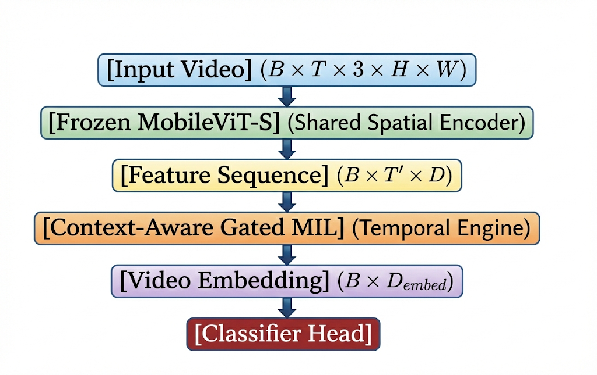
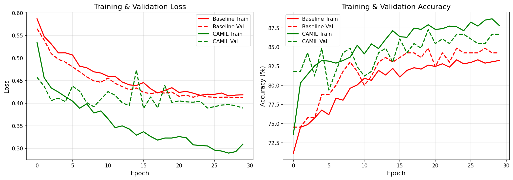
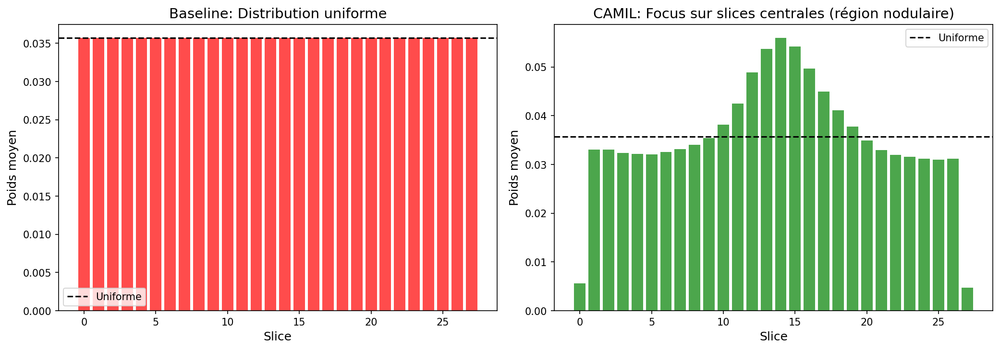
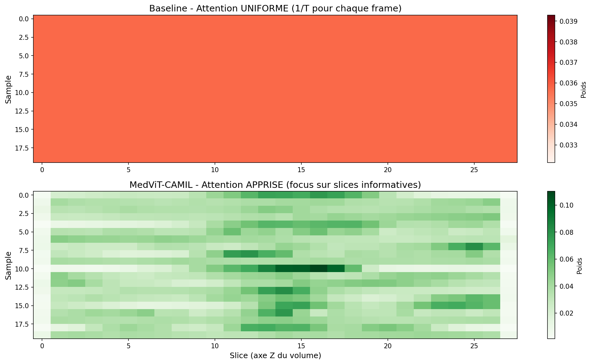

# MedViT-CAMIL

## Ultra-Lightweight Medical Video Analysis via Context-Aware Multiple Instance Learning

MedViT-CAMIL is a specialized deep learning architecture designed for efficient spatiotemporal analysis of medical sequences (MRI, CT, Ultrasound) on resource-constrained edge devices. It specifically addresses the "needle in a haystack" problem where pathological signals are sparse and easily diluted by standard aggregation methods.

## Research Motivation

Diagnostic information in medical volumes is often localized in a small temporal or spatial window. Conventional approaches face several challenges:

- **Redundancy**: Up to 90% of frames may contain non-informative healthy tissue or noise.
- **Dilution**: Global Average Pooling treats all frames equally, averaging out critical pathological signals.
- **Computational Cost**: Large-scale Video Transformers are often too heavy for portable scanners or laptops.

MedViT-CAMIL solves these issues using a frozen spatial encoder combined with a learnable Gated Multiple Instance Learning (MIL) aggregator.

## Architecture

The pipeline consists of three distinct stages designed for maximum efficiency:

1.  **Spatial Feature Extraction**: Utilizes a frozen MobileViT-Small backbone to extract high-quality visual features without the overhead of full fine-tuning.
2.  **Context Injection**: A 1D Context Convolutional layer captures local temporal dependencies between adjacent slices.
3.  **Gated Attention MIL**: An attention mechanism using learnable gates (Tanh and Sigmoid) to assign importance scores to each frame, effectively filtering noise and focusing on pathological evidence.



## Experimental Results (Proxy Mode)

Validation was conducted on the **NoduleMNIST3D** dataset, serving as a scientific proxy for rare-event detection in volumetric scans.

### Quantitative Performance

| Model                   | Validation Accuracy | Test Accuracy |
| :---------------------- | :-----------------: | :-----------: |
| Baseline (AvgPool)      |       84.85%        |    82.90%     |
| **MedViT-CAMIL (Ours)** |     **87.27%**      |  **84.52%**   |
| **Improvement**         |     **+2.42%**      |  **+1.61%**   |

### Training Dynamics

The CAMIL aggregator demonstrates superior convergence and signal separation compared to uniform pooling:



### Interpretability and Attention Analysis

The model automatically learns to identify relevant slices without slice-level supervision. In NoduleMNIST3D experiments, the attention mechanism successfully focused on the central slices (10-20) containing the nodule, while suppressing healthy tissue noise (0-10 and 20-28).




## Execution Protocol

The project supports three distinct operational modes:

1.  **TEST**: Rapid local validation using synthetic data (Speckle noise and artificial lesions).
2.  **PROXY**: Scientific validation on NoduleMNIST3D (Current reported results).
3.  **REAL**: Large-scale training on the **HyperKvasir** dataset (~2GB). This mode is designed for server-side execution and includes automated dataset acquisition.

## Installation and Usage

### Prerequisites

- Python 3.10+
- PyTorch 2.0+
- NVIDIA GPU with CUDA support (Recommended)

### Local Setup

```bash
git clone https://github.com/Tiger-Foxx/MedViT_Research
cd MedViT_Research
pip install -r requirements.txt
```

### Running Experiments

```bash
# Rapid test on laptop
python -m src.main --mode test

# Reproduce proxy results (MedMNIST3D)
python -m src.main --mode proxy --epochs 15

# Large-scale training (HyperKvasir)
python -m src.main --mode real
```

## Large-Scale Server Training (Docker)

For reproducible training on high-performance servers, a Docker configuration is provided. This setup automates the download of the HyperKvasir dataset and configures the environment for multi-GPU training.

```bash
# Build environment
docker build -t medvit-camil .

# Execute REAL mode training
docker run --gpus all -v ./results:/app/results medvit-camil real
```

## Repository Structure

- `src/`: Core implementation (Model, Dataset, Config, Training).
- `doc/`: Research report, figures, and architectural diagrams.
- `notebooks/`: Jupyter notebooks for Proxy and Real-world experimentation.
- `Dockerfile`: Containerization for server-side training.

## References

- **MobileViT**: Mehta & Rastegari, ICLR 2022.
- **Gated Attention MIL**: Ilse et al., ICML 2018.
- **MedMNIST v2**: Yang et al., Nature Scientific Data 2023.
- **HyperKvasir**: Borgli et al., Scientific Data 2020.

## Authors

Research Project - ENSPY (École Nationale Supérieure Polytechnique de Yaoundé)
_Next-Generation Generative and Agentic AI Architectures_
